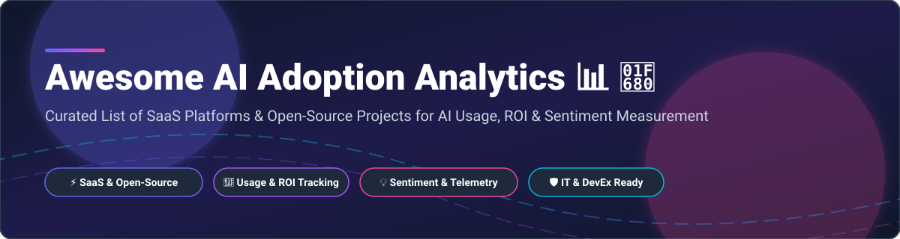

  

# Awesome AI Adoption Analytics 📊 🚀

  
  
  
  
  

> **A curated list of enterprise SaaS products, open-source telemetry tools, Power BI dashboards, and developer productivity analytics platforms focused on AI Usage Measurement, Copilot Adoption, Employee Sentiment Analysis, and AI ROI Tracking.** 📈 ✨

---

## 💡 Sector Market Overview & Dynamics

> 🌐 **Market Size & Structure:** The global AI Adoption Analytics and Digital Employee Experience (DEX) analytics market is estimated at **\$4.5 Billion** and is projected to expand rapidly as enterprise generative AI deployments scale. The sector is currently **moderately fragmented**, balancing major tech ecosystem giants (like Microsoft and Workday) with specialized workforce analytics providers and high-growth open-source observability frameworks. 🧠

---

## 📋 Table of Contents

- [🏢 SaaS & Hosted Platforms](#-saas--hosted-platforms)
- [🔓 Open-Source GitHub Projects](#-open-source-github-projects)
- [🤝 How to Contribute](#-how-to-contribute)
- [☕ Support & Sponsorship](#-support--sponsorship)
- [📜 Disclaimer](#-disclaimer)
- [⭐ Star History](#-star-history)

---

## 🏢 SaaS & Hosted Platforms

The table below details leading commercial platforms for tracking AI tool adoption, sorted by **Company Size / Market Valuation (Descending)**: 🏆

| Platform / Vendor 🛠️ | Company Size / Valuation 💰 | Starting Pricing Tier 💵 | Free Tier / Free Trial Limits ⏱️ | Key Capabilities & Description 📝 |
| :--- | :--- | :--- | :--- | :--- |
| **[Microsoft Copilot Dashboard](https://aka.ms/CopilotDashboard)** | **\$3.1 Trillion** Market Cap | Included with Copilot for M365 (\$30/user/mo) | No standalone free tier; trial via M365 admin center demo | Native Copilot adoption dashboard inside Viva Insights providing zero-deployment visibility into usage, behavioral KPIs, and sentiment surveys. 📊 |
| **[Workday Peakon](https://www.workday.com/en-us/products/employee-voice/overview.html)** | **\$65 Billion** Market Cap | Starts at ~\$5,000/year (~\$5/user/mo) | No free tier or public trial available | Employee engagement platform with continuous AI sentiment listening and adoption barrier analytics. 💬 |
| **[Viva Insights](https://www.microsoft.com/en-us/microsoft-viva/insights)** | **Part of Microsoft (\$3.1T)** | \$6.00 per user/month | 1-month free trial for up to 25 users | Workplace analytics platform tracking collaboration patterns, focus time, and foundational Copilot metrics. ⏱️ |
| **[Qualtrics EmployeeXM](https://www.qualtrics.com/employee-experience/)** | **\$12.5 Billion** Valuation | \$420 per month (billed annually) | Free Account with 500 total response limit | Employee experience suite measuring worker attitudes, perceived productivity impact, and AI adoption barriers. 🎯 |
| **[Culture Amp](https://www.cultureamp.com/)** | **\$1.75 Billion** Valuation | ~\$4,500/year (or \$5–\$9/user/mo) | No free tier; demo available upon sales request | Employee experience platform featuring dedicated AI sentiment surveys and adoption impact benchmarking. 💬 |
| **[Teramind](https://www.teramind.co/)** | **\$500 Million+** Valuation | \$14.00 per user/month (5-seat min) | 7-day cloud trial / 14-day on-prem trial | Workforce analytics and monitoring platform detecting AI tool usage for compliance, productivity, and security. 🛡️ |
| **[ActivTrak](https://www.activtrak.com/)** | **\$300 Million+** Valuation | \$10.00 per user/month (billed annually) | Free plan for up to 3 users with basic activity logs | Workforce analytics providing visibility into employee AI tool adoption patterns and productivity impact. 📈 |
| **[Worklytics](https://www.worklytics.co/)** | **\$50 Million+** Valuation | Custom enterprise quote | 30-day full access free trial | People analytics connecting M365, Google Workspace, and Slack to quantify AI tool adoption and collaboration trends. 🔄 |
| **[Hubstaff](https://hubstaff.com/)** | **\$40 Million+** Valuation | \$4.99 per user/month (billed annually) | 14-day full feature free trial (no credit card required) | Time and application tracking platform monitoring AI app usage and productivity velocity across teams. ⌛ |
| **[Prodoscore](https://www.prodoscore.com/)** | **\$20 Million+** Valuation | \$19.99 per user/month | No free trial available; pilot programs offered | Productivity intelligence platform aggregating AI usage signals alongside cloud app engagement. ⚡ |

---

## 🔓 Open-Source GitHub Projects

Curated open-source tools, solution accelerators, and Power BI dashboards, sorted by **GitHub Star Count (Descending)**: 🌟

| Project & Repository 📦 | GitHub Stars ⭐ | Primary Purpose & Features ⚡ |
| :--- | :--- | :--- |
| **[Arize Phoenix](https://github.com/arize-ai/phoenix)** |  | Open-source AI observability platform for tracing, evaluation, usage analytics, and LLM application monitoring. 🔍 |
| **[OpenTelemetry Collector](https://github.com/open-telemetry/opentelemetry-collector)** |  | Vendor-agnostic proxy to receive, process, and export AI agent telemetry, LLM usage metrics, and audit logs. 📡 |
| **[Helicone](https://github.com/helicone/helicone)** |  | Open-source LLM observability platform providing cost tracking, usage analytics, latency monitoring, and prompt caching. 💸 |
| **[OpenLIT](https://github.com/openlit/openlit)** |  | Open-source OTel-based execution tracing and cost monitoring tool for AI apps, LLMs, and vector databases. ⚡ |
| **[GitHub Copilot Metrics Dashboard](https://github.com/microsoft/copilot-metrics-dashboard)** |  | Microsoft's official solution accelerator visualizing Copilot adoption, active seats, and language acceptance rates. 📊 |
| **[copilot-usage-advanced-dashboard](https://github.com/satomic/copilot-usage-advanced-dashboard)** |  | Grafana & Elasticsearch dashboard overlaying Copilot usage with developer activity (commits, PRs) for true ROI proof. 🚀 |
| **[Microsoft Analytics Hub](https://github.com/microsoft/analytics-hub)** |  | Flagship open-source Power BI templates combining Copilot usage, Purview logs, agent telemetry, and cost reporting. 📑 |
| **[Yavio](https://github.com/teamyavio/yavio)** |  | Self-hosted analytics layer for Model Context Protocol (MCP) servers and ChatGPT Apps, tracking tool calls and funnels. 🔌 |
| **[copilot-metrics-4-every-user](https://github.com/satomic/copilot-metrics-4-every-user)** |  | User-level Copilot usage collector proxying telemetry to visualize granular individual adoption metrics. 👥 |
| **[ai-usage-measurement-framework](https://github.com/satinath-nit/ai-usage-measurement-framework)** |  | CLI and Streamlit dashboard analyzing Git commit history and `Agents.md` files to detect multi-tool AI coding adoption. 💻 |
| **[Copilot Jira Dashboard](https://github.com/Coveros/copilot-jira-dashboard)** |  | Integration correlating GitHub Copilot usage metrics with Jira issue delivery velocity and cycle times. 🎯 |

---

## 🤝 How to Contribute

Contributions are welcome! Please follow these simple guidelines: 🌟

1. Fork this repository. 🍴
2. Add or update entries in `README.md` following the table formats above. 📝
3. Ensure description links to official websites or GitHub repos are accurate and factual. 🔗
4. Submit a Pull Request with a short summary of changes. 🚀

---

## ☕ Support & Sponsorship

If you find this curated collection helpful for your engineering leadership, IT strategy, or People Analytics research, please consider supporting the maintenance of this repository! 💖

- **Star** this repository to show your appreciation! ⭐
- **Fork** it to keep a personal bookmark or contribute additions! 🍴
- **Share** with colleagues and AI adoption strategists! 📢
- **Sponsor:** You can buy me a coffee via the [GitHub Sponsor Dashboard](https://github.com/sponsors/ishandutta2007)! ☕

---

## 📜 Disclaimer

This repository is a community-curated list and does not constitute formal endorsement. AI adoption analytics platforms process sensitive employee activity telemetry and sentiment data; ensure strict adherence to local privacy regulations (GDPR, CCPA) and enterprise compliance guidelines. ⚖️

---

## ⭐ Star History

